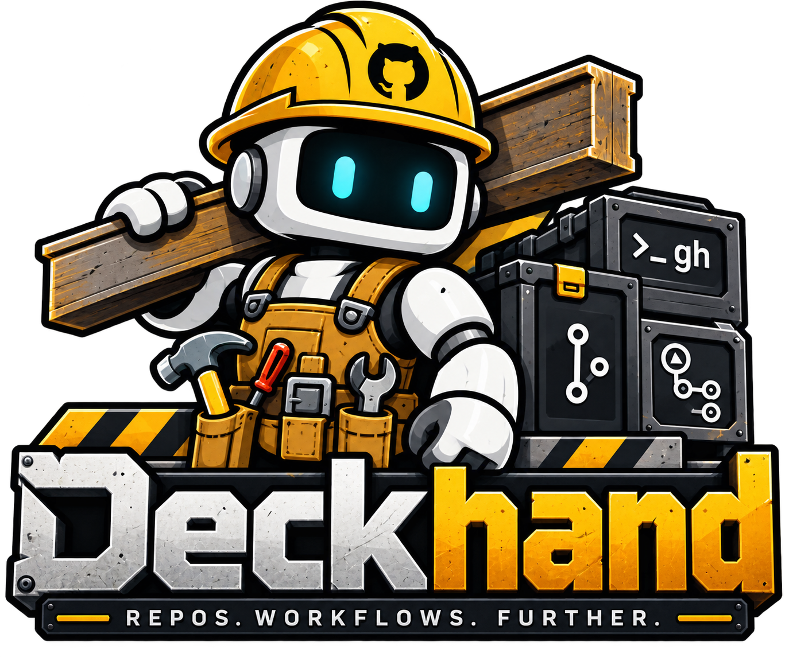

# Deckhand

<p align="center">

</p>


> An intelligent CLI automation framework bridging Vercel Eve and AI Gateway directly to the GitHub CLI (`gh`).

The npm package is **`@genoventures-labs/deckhand`**. The CLI binary is **`deckhand`**.

---

## Overview

**Deckhand** orchestrates local repository management and automated GitHub workflows. Built on Vercel's Eve framework, it routes model calls through [AI Gateway](https://vercel.com/docs/ai-gateway) and uses the official GitHub CLI (`gh`) for version control, issue triage, and CI/CD triggers.

---

## Install

Requires Node.js 20+ (Node 24+ for `deckhand agent` / Eve), plus `git` and `gh`.

```bash
npm install
npm run build
```

That puts `deckhand` on `./node_modules/.bin`. From another machine or a global install:

```bash
npm install -g @genoventures-labs/deckhand
# or, without publishing yet:
npm install -g .
```

Authenticate GitHub and AI Gateway:

```bash
gh auth login
cp .env.example .env.local
# Put your AI Gateway key in .env.local, or:
# vercel link && vercel env pull .env.local
```

Copy `deckhand.example.json` to `deckhand.json` to pin workspaces and the `provider/model` slug (default `openai/gpt-5.6-luna-fast`).

---

## CLI

```bash
deckhand                      # overview + command tables
deckhand help                 # same overview
deckhand help topics          # help catalog
deckhand help runs            # gated-run guide
deckhand doctor               # dependency table
deckhand status               # repo + change tables
deckhand watch                # directory monitoring
deckhand sync                 # add + Gateway commit message + push
deckhand pull                 # git pull --ff-only
deckhand branch <name>
deckhand conflicts            # conflict list + model guidance
deckhand pr create -t "..."
deckhand issue create -t "..."
deckhand repo create <name>
deckhand project create -t "..." -o <owner>
deckhand checks
deckhand actions list
deckhand actions watch [runId]
deckhand actions run <workflow>
deckhand runs list            # gated YAML templates
deckhand agent                # Eve terminal session
```

`deckhand sync` writes a commit message through AI Gateway from the current diff. Pass `-m` to skip generation, or `--no-push` to commit only.

---

## Gated runs

YAML templates declare *what* runs and *when*. GitHub Environments (`deckhand-gate`) hold the execute job until a reviewer approves.

```bash
deckhand runs list
deckhand runs init morning-pull
deckhand runs install-workflow morning-pull
deckhand runs apply morning-pull --approve
```

| Template | Cron (local TZ) | Action | Gate |
| :--- | :--- | :--- | :--- |
| `morning-pull` | `0 5 * * *` America/Los_Angeles | `git pull --ff-only` | `deckhand-gate` |
| `weekday-status` | `0 8 * * 1-5` | `status` | off |
| `gated-sync` | `0 18 * * 1-5` | commit, no push | `deckhand-gate` |
| `nightly-checks` | `0 23 * * *` | PR checks | `deckhand-gate` |

Copy the YAML into `.deckhand/runs/` and the matching workflow into `.github/workflows/`. Then in the GitHub repo: **Settings → Environments → `deckhand-gate` → Required reviewers**.

GitHub Actions cron is UTC (`0 13 * * *` ≈ 5am PST). Self-hosted or `deckhand runs apply` honor the YAML `timezone` as documentation of intent; wire a local scheduler (Task Scheduler, cron) if you want true local 5am without GitHub.

Schema: `templates/schema/gated-run.v1.json`.


---

## Features

### Automated Change Detection & Sync

- **Directory Monitoring:** Scans configured local workspaces to detect file updates and status changes (`deckhand watch`).
- **Intelligent Git Operations:** Stages, commits, pushes, and fast-forward pulls from detected diffs (`deckhand sync` / `pull`).
- **Status Reporting:** Prints whether the tree is clean and when a sync finishes.

### Repository & Workflow Management

- **Entity Generation:** Branches, pull requests, issues, repositories, and GitHub Projects via `gh`.
- **Assisted Resolution:** Conflict listing plus a gateway-model write-up of resolution options.
- **CI/CD Integration:** Trigger, list, watch, and surface GitHub Actions runs and PR checks.
- **Gated runs:** YAML templates for scheduled pulls, status, sync, and checks, with a GitHub Environment approval gate.

### Eve agent

`agent/` is a filesystem-first Eve app. Tools wrap the same git/`gh` helpers as the CLI. `deckhand agent` starts `eve dev` with `DECKHAND_CWD` pointed at your repo. Push, repo creation, and workflow triggers ask for approval.

---

## Architecture & Dependencies

| Tool | Role | Reference |
| :--- | :--- | :--- |
| **Vercel Eve** | Core AI Framework | [eve.dev/docs](https://eve.dev/docs) |
| **Vercel AI Gateway** | Model routing | [vercel.com/docs/ai-gateway](https://vercel.com/docs/ai-gateway) |
| **GitHub CLI (`gh`)** | GitHub Interface Layer | [cli.github.com](https://cli.github.com/) |
| **GitHub Actions** | CI/CD Pipeline Automation | [github.com/features/actions](https://github.com/features/actions) |

---

## Scripts

| Script | What it does |
| :--- | :--- |
| `npm install` | Install CLI + Eve runtime dependencies |
| `npm run build` | Compile `src/` to `dist/` |
| `npm run dev` | Run the CLI through `tsx` |
| `npm run eve:dev` | Start Eve against `./agent` |
